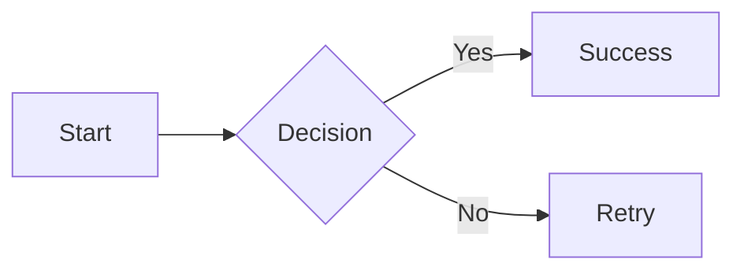

# Markdown Feature Test

This file is intended to exercise most syntax defined by **CommonMark**, followed by common **GitHub Flavored Markdown (GFM)** extensions.

---

# 1. Headings

# Heading level 1
## Heading level 2
### Heading level 3
#### Heading level 4
##### Heading level 5
###### Heading level 6

Alternative H1
==============

Alternative H2
--------------

---

# 2. Paragraphs and line breaks

This is a normal paragraph containing multiple sentences. Markdown collapses ordinary line breaks inside a paragraph into spaces in most renderers.

This line ends with two spaces.  
This should be a hard line break.

This line ends with a backslash.\
This should also be a hard line break in CommonMark.

---

# 3. Emphasis

*Italic with asterisks*

_Italic with underscores_

**Bold with asterisks**

__Bold with underscores__

***Bold and italic with asterisks***

___Bold and italic with underscores___

**Bold containing *italic* text**

*Italic containing **bold** text*

Text_with_internal_underscores_should_not_be_emphasized.

---

# 4. Escaping punctuation

\*Not italic\*

\# Not a heading

\[Not a link\]

\\ Backslash

Escaped punctuation: \! \" \# \$ \% \& \' \( \) \* \+ \, \- \. \/ \: \; \< \= \> \? \@ \[ \\ \] \^ \_ \` \{ \| \} \~

---

# 5. Block quotes

> This is a block quote.
>
> It contains a second paragraph.
>
> > This is a nested block quote.
>
> - Block quotes can contain lists.
> - Another item.

---

# 6. Unordered lists

- Item using hyphen
- Second item
  - Nested item
    - Deeply nested item

* Item using asterisk
* Second item

+ Item using plus
+ Second item

Loose list:

- First item, paragraph one.

  Paragraph two inside the first item.

- Second item.

---

# 7. Ordered lists

1. First item
2. Second item
3. Third item

Ordered list with arbitrary source numbers:

1. First
1. Second
1. Third

List starting at another number:

5. Five
6. Six
7. Seven

Nested ordered/unordered lists:

1. Parent
   1. Child ordered
   2. Child ordered
      - Child unordered
      - Another child
2. Second parent

---

# 8. Code spans

Inline code: `const x = 42;`

Code containing a backtick: `` `backtick` ``

Code span with spaces: `` code with spaces ``

Literal Markdown inside code: `**not bold**` and `# not heading`

---

# 9. Fenced code blocks

```text
Plain fenced code block.
Markdown **is not rendered** here.
<tags> stay literal.
```

```javascript
function hello(name) {
  console.log(`Hello, ${name}!`);
}

hello("Markdown");
```

~~~python
def fibonacci(n):
    a, b = 0, 1
    for _ in range(n):
        yield a
        a, b = b, a + b
~~~

Fence containing shorter fence markers:

````markdown
```js
console.log("nested fence example");
```
````

---

# 10. Indented code blocks

    This is an indented code block.
    Four leading spaces are used.

---

# 11. Thematic breaks

---

***

___

- - -

* * *

---

# 12. Links

Inline link: [OpenAI](https://openai.com)

Inline link with title: [CommonMark](https://commonmark.org "CommonMark specification")

Relative link: [Relative document](./other-file.md)

Fragment link: [Jump to headings](#1-headings)

Empty link destination: [empty](<>)

Link destination in angle brackets: [Example](<https://example.com/a path>)

---

# 13. Reference links

[Reference link][ref]

[Collapsed reference link][]

[Shortcut reference link]

[Case-insensitive reference][REF]

[ref]: https://example.com/reference "Reference title"
[collapsed reference link]: https://example.com/collapsed
[shortcut reference link]: https://example.com/shortcut

---

# 14. Images

Inline image:


Reference image:

![Reference image][sample-image]

[sample-image]: https://dummyimage.com/120x60/dddddd/000000.png&text=Image

Image used inside a link:

[](https://example.com)

---

# 15. Autolinks — CommonMark angle-bracket form

<https://example.com>

<mailto:user@example.com>

<user@example.com>

---

# 16. Raw HTML

<div class="markdown-test">
  <strong>Raw HTML block</strong>
  <p>This paragraph is written as HTML.</p>
</div>

Inline HTML: <span title="example">inline span</span>.

HTML comment:

<!-- This comment should not normally be visible after rendering. -->

---

# 17. HTML entities and character references

&amp; &lt; &gt; &quot; &copy; &#169; &#x1F600;

---

# 18. Backslash and punctuation edge cases

Asterisks used literally: 2 \* 3 = 6.

Underscores in identifiers: snake_case_identifier.

Hash inside text: C# language.

Plus/minus: +1, -1.

---

# 19. Nested block structures

> 1. Ordered item inside quote
>    - Nested unordered item
>      
>      ```sh
>      echo "code inside nested list inside quote"
>      ```
>
> Final quoted paragraph.

---

# 20. List items containing multiple block types

1. Paragraph in list item.

   > Block quote inside the list item.

   ```json
   {
     "code": "inside list"
   }
   ```

2. Second list item.

---

# 21. Character formatting interactions

***bold italic***

**bold and `code`**

*italic and [link](https://example.com)*

[`code link`](https://example.com)

> **Bold inside quote**, *italic inside quote*, and `code`.

---

# 22. Unicode

English: Hello, world!

中文：你好，世界！

日本語：こんにちは世界！

한국어: 안녕하세요 세계!

Emoji: 😀 🚀 ❤️ 👍🏽 🧪

Math-like Unicode: α β γ ∑ ∫ √ ∞ ≠ ≤ ≥

---

# 23. GFM: Strikethrough

~~Strikethrough text~~

This is ~~deleted~~ replaced text.

---

# 24. GFM: Task lists

- [x] Completed task
- [ ] Incomplete task
- [X] Completed task with uppercase X
  - [x] Nested completed task
  - [ ] Nested incomplete task

---

# 25. GFM: Tables

| Left aligned | Center aligned | Right aligned |
| :----------- | :------------: | ------------: |
| A            | B              | 123           |
| Long text    | Center         | 456.78        |
| `code`       | **bold**       | [link](https://example.com) |

Escaped pipe inside table:

| Column 1 | Column 2 |
| --- | --- |
| A \| B | C |

---

# 26. GFM: Extended autolinks

https://example.com

www.example.com

user@example.com

---

# 27. GFM: Disallowed raw HTML tags

Depending on the renderer and sanitizer, tags such as the following may be escaped or removed:

<script>alert('test')</script>

<style>.example { color: red; }</style>

---

# 28. Common renderer extensions — not part of CommonMark/GFM core

The following features are intentionally included to test whether a renderer supports popular non-standard extensions.

## 28.1 Footnotes

Here is a sentence with a footnote.[^1]

Here is another footnote with a longer label.[^long-note]

[^1]: This is the first footnote.
[^long-note]: This is a longer footnote definition.

## 28.2 Definition lists

Term 1
: Definition 1

Term 2
: Definition 2

## 28.3 Highlight / mark

==Highlighted text==

## 28.4 Subscript and superscript

H~2~O

X^2^

## 28.5 Emoji shortcode

:smile: :rocket: :+1:

## 28.6 Heading attributes

### Heading with explicit ID {#custom-heading-id}

## 28.7 Math

Inline math: $E = mc^2$

Display math:

$$
\int_{-\infty}^{\infty} e^{-x^2}\,dx = \sqrt{\pi}
$$

LaTeX-style escaped delimiters:

\(
E = mc^2
\)

\[
a^2 + b^2 = c^2
\]

## 28.8 Mermaid



## 28.9 Admonitions

> [!NOTE]
> This tests GitHub-style alert/admonition rendering.

> [!TIP]
> Useful information.

> [!IMPORTANT]
> Important information.

> [!WARNING]
> Warning information.

> [!CAUTION]
> Caution information.

---

# 29. Empty and unusual constructs

Empty block quote:

>

Empty-looking list item:

-

Empty emphasis markers should remain literal in conforming parsers:

**

__

---

# 30. Link parsing edge cases

Nested parentheses in URL:

[Wikipedia example](https://en.wikipedia.org/wiki/Function_(mathematics))

Escaped parentheses:

[Escaped](https://example.com/foo\(bar\))

Title with single quotes:

[Example](https://example.com 'Single-quoted title')

Title with parentheses:

[Example](https://example.com (Parenthesized title))

---

# 31. Emphasis delimiter edge cases

foo_bar_baz

foo*bar*baz

foo**bar**baz

***strong emphasis***

****four stars****

---

# 32. Code and HTML interaction

`<strong>not HTML inside code</strong>`

```
<div>not parsed as HTML inside fenced code</div>
```

---

# 33. URLs with punctuation

<https://example.com/test_(one)>

A plain GFM URL followed by punctuation: https://example.com/test.

Email punctuation test: user@example.com.

---

# 34. Mixed-language punctuation

中文 **粗体**、*斜体*、`代码`、[链接](https://example.com)。

日本語 **太字** と *斜体*。

---

# 35. Final parser sanity check

If this sentence renders normally, the parser reached the end of the document.
